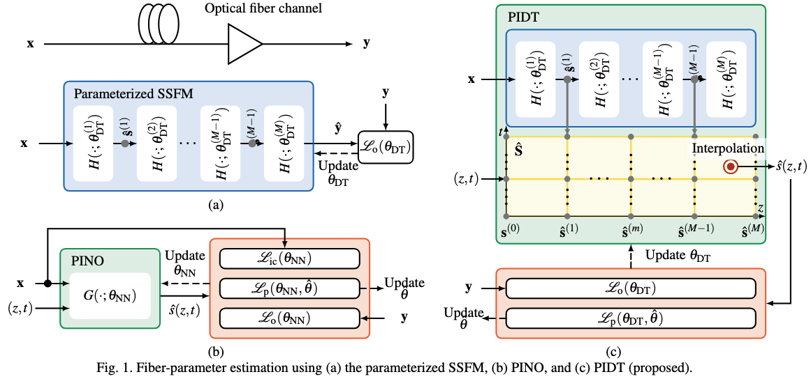
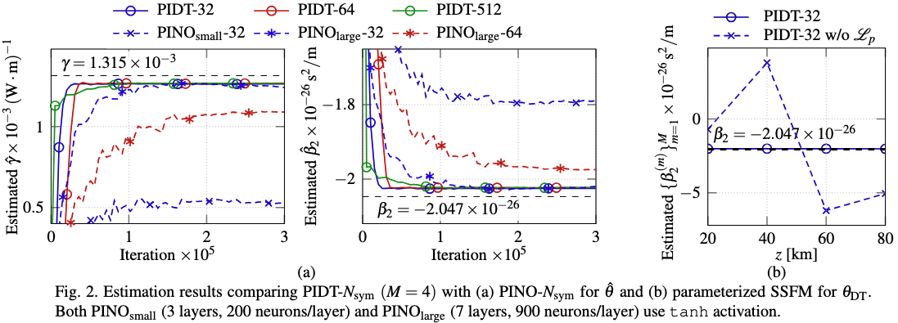

<div align="center">
<h1>PIDT: Physics-Informed Digital Twin for Optical Fiber Parameter Estimation</h1>

<a href="" target="_blank" rel="noopener noreferrer">
  
</a>
<a href=""></a>
<a href="/"></a>

**[Department of Electrical Engineering, Chalmers University of Technology](https://www.chalmers.se/en/departments/e2/)**<br>
**[Department of Microtechnology and Nanoscience, Chalmers University of Technology](https://www.chalmers.se/en/departments/mc2/)**

[Zicong Jiang](https://zicongjiang.github.io/zicong-jiang/), [Magnus Karlsson](https://www.chalmers.se/en/persons/magkar/), [Erik Agrell](https://www.chalmers.se/en/persons/agrell/), [Christian Häger](https://chaeger.github.io/)
</div>

````
⚠️ The code will be realsed once the paper is accepted.
````

## Overview

We propose physics-informed digital twin (PIDT): a fiber parameter estimation approach that combines a parameterized split-step method with a physics-informed loss. PIDT improves accuracy and convergence speed with lower complexity compared to previous neural operators.



Performance




## Install dependencies

```
# step 1: create a new conda environment (tested on Windows)
conda create -n pidt python=3.10

# step 2: activate the environment
conda activate pidt

# step 3: install the dependencies
python -m pip install --upgrade pip

## PyTorch
pip install torch==2.0.1+cu117 torchvision==0.15.2+cu117 --extra-index-url https://download.pytorch.org/whl/cu117

## JAX
pip install --upgrade "jax[cuda12]"

## Others
pip install -r requirements.txt
```
<!-- pip install tqdm

pip install interpax

pip install pyyaml

pip install matplotlib
pip install pandas
pip install scipy -->

<!-- # step 1: create a new conda environment (tested on Linux)
conda create -n fds python=3.10 pip
# or `conda create --prefix /data/conda/fds python=3.10 pip` if you want to install it in a specific directory

# step 2: activate the environment
conda activate fds
# or `conda activate /data/conda/fds` if you installed it in a specific directory

# step 3: install the dependencies
pip install -r requirements.txt

# step 4: install additional dependencies
git clone https://github.com/fbcotter/pytorch_wavelets
cd pytorch_wavelets
pip install .
cd .. -->

### Parameter estimation

####  The PIDT for parameter estimation

```python
python main.py --N_data 1000 --Nitr 300000 --nsym 32 --sps 2 --step_num 50 --step_num_dt 4 --power_dbm 0 --lamio 1 --loss l1 --noise_db 20
```

####  The PINO for parameter estimation

```python
python main_pino.py --power_dbm 0 --sps 2 --nsym 32 --N_data 1000 --Nitr 300000 --N_neurons 900 --feature_size 900 --N_layers 8 --noise_db 20 --lr 1e-3
```

---
Thanks for your interest in our work!
If you find our work useful, please consider citing our paper or using this implementation.
```bibtex
@article{
}
```